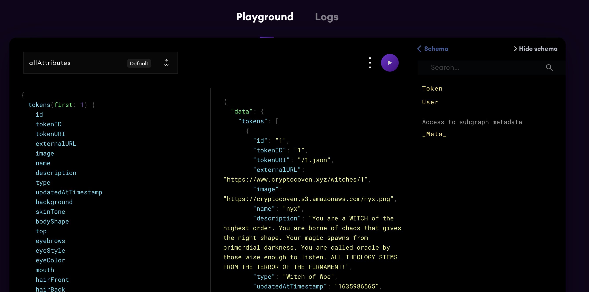

# Crypto Coven

This is a Graph Protocol API which demonstrates how GraphQL can be used to query NFT metadata, using the lovely crypto covens as an example. It borrows from [this](https://github.com/dabit3/cryptocoven-api) project, while exposing some additional fields and introducing testing. Read more about Crypto Covens [here](https://www.cryptocoven.xyz/).

## Introduction to the Graph Protocol

The Graph is a decentralized protocol for indexing and querying data from blockchains, starting with Ethereum. It makes it possible to query data that is difficult to query directly.

Projects with complex smart contracts like Uniswap and NFTs initiatives like Bored Ape Yacht Club store data on the Ethereum blockchain, making it really difficult to read anything other than basic data directly from the blockchain.

In the case of Bored Ape Yacht Club, we can perform basic read operations on the contract like getting the owner of a certain Ape, getting the content URI of an Ape based on their ID, or the total supply, as these read operations are programmed directly into the smart contract, but more advanced real-world queries and operations like aggregation, search, relationships, and non-trivial filtering are not possible. For example, if we wanted to query for apes that are owned by a certain address, and filter by one of its characteristics, we would not be able to get that information by interacting directly with the contract itself.

To get this data, you would have to process every single transfer event ever emitted, read the metadata from IPFS using the Token ID and IPFS hash, and then aggregate it. Even for these types of relatively simple questions, it would take hours or even days for a decentralized application (dapp) running in a browser to get an answer.

You could also build out your own server, process the transactions there, save them to a database, and build an API endpoint on top of it all in order to query the data. However, this option is resource intensive, needs maintenance, presents a single point of failure, and breaks important security properties required for decentralization.

Indexing blockchain data is really, really hard.

Blockchain properties like finality, chain reorganizations, or uncled blocks complicate this process further, and make it not just time consuming but conceptually hard to retrieve correct query results from blockchain data.

The Graph solves this with a decentralized protocol that indexes and enables the performant and efficient querying of blockchain data. These APIs (indexed "subgraphs") can then be queried with a standard GraphQL API. Today, there is a hosted service as well as a decentralized protocol with the same capabilities. Both are backed by the open source implementation of Graph Node.

Check out more [here](https://thegraph.com/en/)

## How to query the API

This is still a work in progress, but you can play around with the tool [here](https://thegraph.com/hosted-service/subgraph/sulscott/gaem?version=current). Feel free to read up on the [official graph documentation](https://thegraph.com/docs/en/developer/query-the-graph/) for additional queries.

## Testing

Setting up testing is still work in progress, but the framework used will be matchstick. The quickstart guide can be found [here](https://github.com/LimeChain/matchstick/blob/main/README.md#quick-start-)

## What's Next?

This is my first Graph project, so hopefully many more will come as it's a very fun space to work in. For this particular project, there are several key attributes which aren't populating correctly, so a future code change will address that. Furthermore, unit tests will be built out in time. Feel free to contribute if you're passionate about this. I'd also like to incorporate a React front end application which can, for example, render NFT images based on queries that a user inputs. 